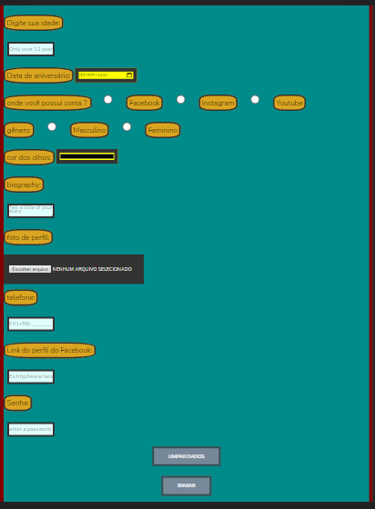

# Form-in-HTML
 

# Form-in-HTML
<!---Esses são exemplos. Veja https://shields.io para outras pessoas ou para personalizar este conjunto de escudos. Você pode querer incluir dependências, status do projeto e informações de licença aqui--->

> o projeto se trata de uma uma breve apresentação  .

## 🤝 Colaboradores

Agradecemos às seguintes pessoas que contribuíram para este projeto:

<table>
  <tr>
    <td align="center">
      <a href="#">
         
        
          <b>Kevin Mateus</b>
        
      </a>
    </td>
   
</table>
